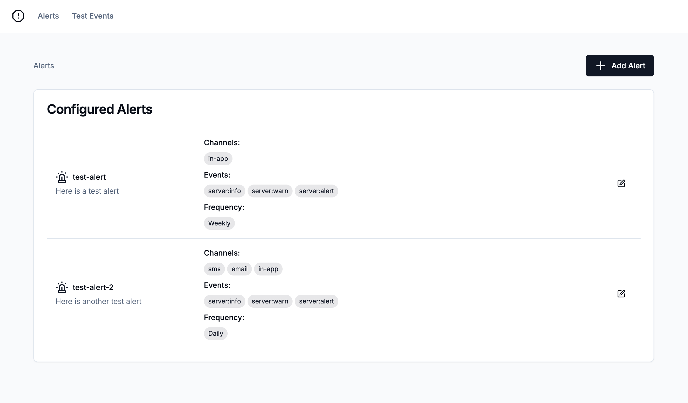
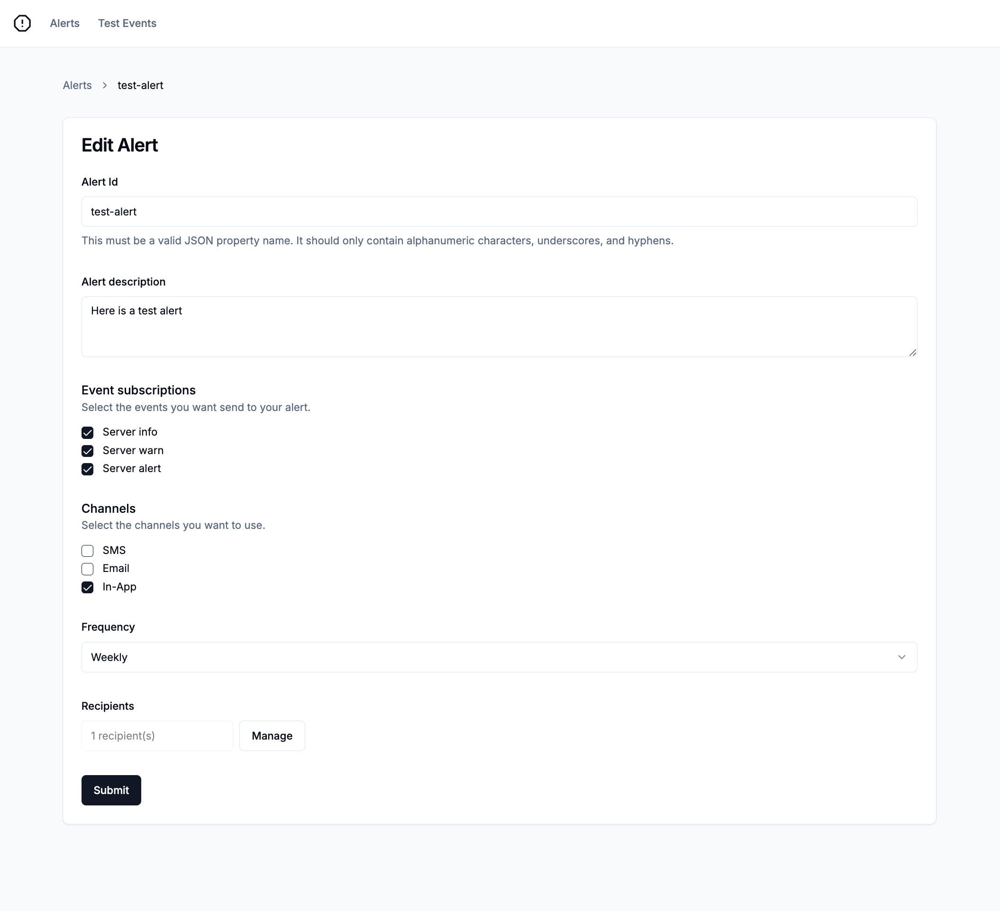
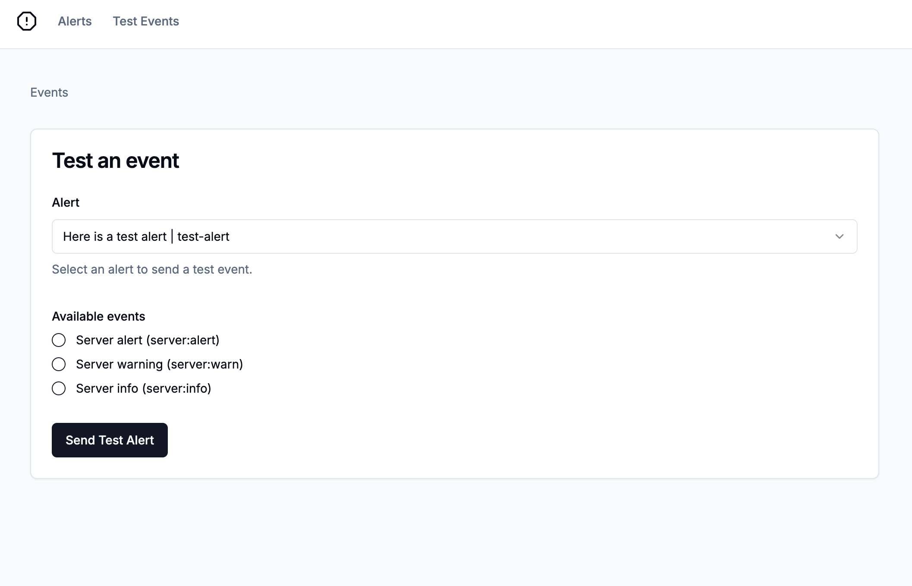

# Building a customer-facing alerting system with Knock

This example app builds on [this guide](https://docs.knock.app/guides/alerting) from the official docs. It provides you an easy way to implement the steps outlined there and demonstrates how to create alerts in your application. The app itself is built using Next.js and shadcn/ui.



## Getting started

To get started, you can clone this repository with the following command:

```bash
git clone https://github.com/knocklabs/customer-facing-webhooks-example.git
```

Next, you'll want to create a new copy of the `.env.sample` file to use in your project:

```bash
cp .env.sample .env.local
```

From here, you'll need to provide values for the following environment variables. You may also need to create a few resources in Knock:
| Env Var | Description |
| ---------------------------------- | --------------------------------------------------------------------------------------------------------------------------------------------------------------------------------------------------------------------------------------------------------------------------------------------- |
| KNOCK_API_KEY | This value comes from Knock and is used to authenticate server-side API requests. You can find it listed as the secret key under "Developers" > "API keys." **This is a secret value and should not be exposed publicly.** |
| KNOCK_ALERT_COLLECTION | This value will provide the name for your collection of alert configuration objects. You can use 'alerts' as a default if you're using this as a PoC |
| KNOCK_ALERT_WORKFLOW_KEY | This value comes from Knock after you create the workflow that will generate your alert messages. |

## Modeling alerts with objects in Knock

In this section, we will explore how to model alerts using objects in Knock. In Knock, you can think of [Objects](https://docs.knock.app/concepts/objects) as a NoSQL data store for non-user entities. In other words, you can create JSON-shaped entities inside of collections that map to parts of your application's data model.

In this app, we'll create an entity inside of the `alerts` collection to store information about the alert configuration. Each `object` can have custom properties like a `description` or an array of `events` the alert is subscribed to.



In this application, the `SetAlertForm` component calls a server action that runs the following code to create or update our alert entity:

```javascript
  const knock = new Knock(process.env.KNOCK_API_KEY);
  const objectId = slugify(values.id);

  await knock.objects.set(
    process.env.KNOCK_ALERT_COLLECTION as string,
    objectId,
    {
      name: values.id,
      description: values.description,
      events: values.events,
      channels: values.channels,
      batchWindow: values.batchWindow,
      frequency: values.frequency,
    }
  );
```

### Powering recipient subscriptions with objects

You will also use [objects to power subscriptions](https://docs.knock.app/concepts/objects#object-subscribers), which is a powerful pattern that simplifies triggering workflows for multiple recipients. After creating or updating the alert, we'll also update the `subscriptions` for the alert to ensure that the correct recipients are subscribed to the alert.

```javascript
 //Removes subscriptions for recipients that are no longer in the form

  if (values.removedRecipients.length > 0) {
    await knock.objects.deleteSubscriptions(
      process.env.KNOCK_ALERT_COLLECTION as string,
      objectId,
      {
        recipients: values.removedRecipients,
      }
    );
  }
  // Add subscriptions for each recipient
  if (values.recipients.length > 0) {
    await knock.objects.addSubscriptions(
      process.env.KNOCK_ALERT_COLLECTION as string,
      objectId,
      {
        recipients: values.recipients,
      }
    );
  }
```

In our application, we manage this list of recipients in the `SetAlertForm` component. The `alerts/[alertId]/page.tsx` file loads the alert object, the current subscriptions, and a list of users to Knock. The `SetAlertForm` component then uses this data to keep track of which recipients are currently subscribed to the alert and which recipients have been removed.

## Triggering test events in Next.js with Knock workflows

In this section, we will learn how to trigger test events from Next.js by utilizing Knock workflows. Knock workflows are triggered using an API request or SDK method call that contains a `recipient` that will receive the notification, payload `data` that can be used in the message template, as well as other optional properties like `tenant.`



The `TestEventForm` component calls a server action that triggers your workflow using the following code:

```javascript
  const knock = new Knock(process.env.KNOCK_API_KEY);
  const alertRef = await knock.objects.get(
    process.env.KNOCK_ALERT_COLLECTION as string,
    values.alertId
  );
  const workflow_run_id = await knock.workflows.trigger(
    process.env.KNOCK_ALERT_WORKFLOW_KEY as string,
    {
      recipients: [
        {
          id: values.alertId,
          collection: process.env.KNOCK_ALERT_COLLECTION as string,
        },
      ],
      data: {
        alert: {
          ...alertRef.properties,
        },
        event: values.eventType,
      },
    }
  );
```

First, we use the `KNOCK_ALERT_WORKFLOW_KEY` environment variable to make sure we're triggering the correct workflow.

Then, we provide the `id` and `collection` of the selected alert as an entry in the `recipients` array.

The `data` key is a JSON object that contains the custom payload for our workflow, which contains an `event` that will be matched against allowed `events` on our alert object. We'll also fetch the alert using `knock.objects.get` to make it easier to access the alert properties in the workflow. We can pass those properties to the workflow as a JSON object in the `alert` key.
